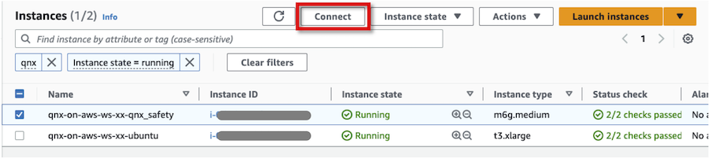
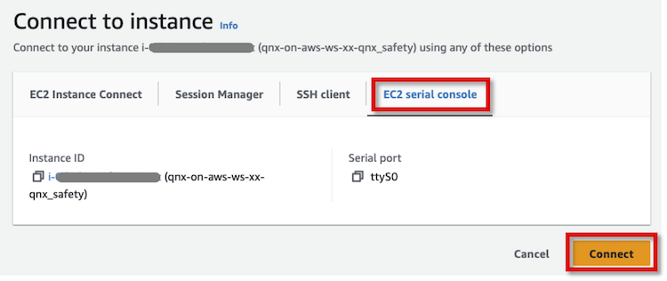
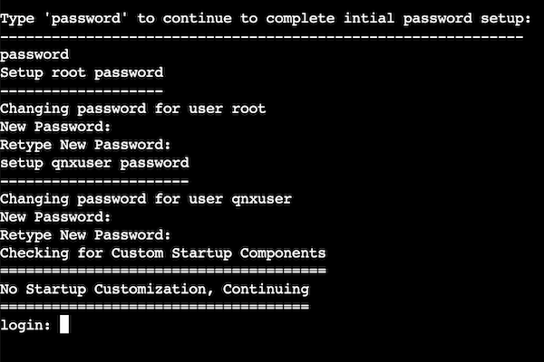
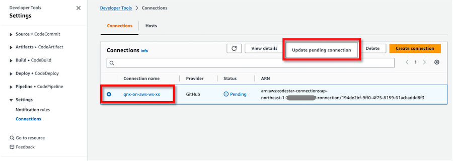

# Instructions

## Prepare workshop environment

### Prepare information used in the workshop

Please make sure you have the following information before working on the workshop.

* AWS 
    * AWS account ID
    * AWS credentials
        * Management Console login: User ID, Password
        * API/CLI: Access key, Secret access key, (Session token)
    * AWS region
* BlackBerry QNX
    * myQNX Account, Password
    * Evaluation license reference serial number of QNX SDP 7.x
* GitHub
    * GitHub user
    * GitHub repository
* Unique 2-digit ID per participant

| :exclamation: Assign and use a unique 2-digit ID per participant |
|:---------------------------|
| Replace `xx` in the workshop steps with a 2-digit ID that is not identical to any other workshop participants. The ID will prevent resource name conflicts during the workshop with multiple users in the same AWS account. Please be sure to use a 2-digit ID. Using a longer ID could cause errors. |


### Install prerequisite software

Follow the instruction below to install each software.

* AWS CLI version 2: [Installing or updating the latest version of the AWS CLI](https://docs.aws.amazon.com/cli/latest/userguide/getting-started-install.html)
* AWS CLI Session Manager plugin: [Install the Session Manager plugin for the AWS CLI](https://docs.aws.amazon.com/systems-manager/latest/userguide/session-manager-working-with-install-plugin.html)
* Terraform version 1.5.0 or higher: [Install Terraform](https://developer.hashicorp.com/terraform/tutorials/aws-get-started/install-cli)


### Prepare QNX software

QNX AMIs are provided as third party software in AWS Marketplace. Users can use the software on their AWS infrastructure through subscription.

Log in to AWS Management Console as a user with the administrative permissions, and then subscribe to [AWS Marketplace: QNX OS for Safety 2.2.3](https://aws.amazon.com/marketplace/pp/prodview-26pvihq76slfa) in AWS Marketplace. The page provides the product overview, pricing, usage information, and support information etc. Read the Terms and Conditions, and accept if you agree to proceed.


## Configure and deploy the environment

### Log in to an AWS account

Launch a web browser and log in to the AWS Management Console as a user with administrative privileges.

Launch a terminal and set the AWS credentials as environment variables on the terminal.

```shell
export AWS_ACCESS_KEY_ID="<YOUR_AWS_ACCESS_KEY>"
export AWS_SECRET_ACCESS_KEY="<YOUR_AWS_SECRET_ACCESS_KEY>"
```

Set default AWS region to `AWS_DEFAULT_REGION` environment variable to specify the AWS Region you want to send your requests to by default.
```shell
export AWS_DEFAULT_REGION="<YOUR_AWS_REGION>"
```


### Clone Git repository

Run the command below to clone the git repository.

```
git clone https://github.com/aws-samples/qnx-on-aws-workshop.git
cd qnx-on-aws-workshop/
```


### Configure the environment

Copy `terraform/terraform.tfvars.template` file to `terraform/terraform.tfvars`.

```shell
cp terraform/terraform.tfvars.template terraform/terraform.tfvars
```

Update configurations in `terraform/terraform.tfvars`.

```shell
ubuntu_user_password         = "<your_password>"          # Ubuntu 'ubuntu' user password
github_user                  = "<github_user>"            # GitHub user name for CI/CD
github_repo                  = "<github_repo>"            # GitHub repository name for CI/CD
```

Open `terraform/main.tf` file, then replace the following values in Terraform local values configuration.
* Replace `xx` in the `name`'s value with 2-digit ID (e.g. `qnx-on-aws-ws-01`)
* Replace AWS region code you use

```hcl
# ------------------------------------------------------------
# Local values
# ------------------------------------------------------------
locals {
  name       = "qnx-on-aws-ws-xx"   # Replace `xx` with 2-digit ID
  region     = "<YOUR_AWS_REGION>"     # Specify your AWS region
```


### Deploy the environment

Run the following terraform commands to deploy the base environment for the workshop. Make sure to run the command in `terraform/` directory.

```shell
cd terraform/
terraform init
terraform plan
terraform apply --auto-approve
```


## Create custom QNX AMI

With the default QNX AMI, login passwords and service auto-start are not configured. Only for the first time EC2 QNX instance is launched, we will log in to QNX OS from EC2 serial console and configure the environment. After configuring the environment, we will create a new custom QNX AMI. We can launch EC2 QNX instances using the new custom QNX AMI.

### Configure a custom QNX AMI


Choose a corresponding EC2 QNX instance from EC2 Console, and click **Connect**.



Choose **EC2 serial console** tab in the following screen, then click **Connect** to log in QNX OS.



Press Enter key and type `password`, then the initial password setup prompt will be displayed. Then you can set the default login passwords for `root` user and `qnxuser` user, respectively.




Log in as `root` user, then run the command below to configure `qconn` daemon auto-start at QNX OS launch.

```shell
login: root
Password: <ENTER ROOT PASSWORD>
```

```shell
echo qconn >> /var/start_script.sh
```


| :exclamation: Important |
|:---------------------------|
| QNX SDP uses qconn daemon to allow access to QNX OS. It is important that the security group of EC2 QNX instance has port 8000 open as Custom TCP allowing access for the development host to connect. With qconn, a user can log in to QNX OS without authentication and can gain access to files on QNX OS. To protect QNX OS environment, we strongly recommend to deny all accesses except from limited development hosts using security group and Network ACL. In the workshop, the access to qconn is only allowed from EC2 Ubuntu instance. See [qconn](http://www.qnx.com/developers/docs/7.0.0/index.html#com.qnx.doc.neutrino.utilities/topic/q/qconn.html) for further details of qconn daemon.|


### Create a custom QNX AMI

Run following commands to create custom QNX AMI. Replace `xx` with your 2-digit ID (e.g. `qnx-safety-custom-01`). 

```shell
AMI_NAME="qnx-safety-custom-xx"
INSTANCE_ID=$(terraform output -raw ec2_instance_qnx_safety_instance_id)
aws ec2 create-image --instance-id ${INSTANCE_ID} --name ${AMI_NAME} --tag-specifications "ResourceType=image,Tags=[{Key=Name,Value=${AMI_NAME}}]"
```

Example output:

```shell
$ AMI_NAME="qnx-safety-custom"
$ INSTANCE_ID=$(terraform output -raw ec2_instance_qnx_safety_instance_id)
$ aws ec2 create-image --instance-id ${INSTANCE_ID} --name ${AMI_NAME} --tag-specifications "ResourceType=image,Tags=[{Key=Name,Value=${AMI_NAME}}]"
{
    "ImageId": "ami-04f6f6c2a180cd137"
}
```

Run `aws ec2 describe-images` command to check the progress of creating AMI. Replace AMI ID with your new AMI ID shown above, then run the following command. If `State` is `available`, the creation of your custom QNX AMI is completed.

```
$ aws ec2 describe-images --image-ids ami-04f6f6c2a180cd137
{
    "Images": [
        {
            "Architecture": "arm64",
            "CreationDate": "2023-03-25T11:50:25.000Z",
            "ImageId": "ami-04f6f6c2a180cd137",
            "ImageLocation": "123456789012/qnx-safety-custom",
            "ImageType": "machine",
            "Public": false,
            "OwnerId": "123456789012",
            "PlatformDetails": "Linux/UNIX",
            "UsageOperation": "RunInstances",
            "ProductCodes": [
                {
                    "ProductCodeId": "2oe9ogrqr69u5mzyjhb34q2eo",
                    "ProductCodeType": "marketplace"
                }
            ],
            "State": "available",
##### Omit #####
        }
    ]
}
```

### Deploy a new EC2 QNX instance

Comment out the existing AMI ID configuration and replace it with the newly created AMI ID in the following two files. Your custom QNX AMI ID should be different from others'.

* `terraform/main.tf`
* `github-example-repo/main.tf`

```hcl
  ec2_qnx_safety = {
    # ami                   = "${local.ec2_qnx_safety_2_2_x_amis[local.region]}" # Default QNX OS for Safety 2.2.3 AMI
    ami                   = "<YOUR_CUSTOM_AMI_ID>"  # Custom QNX OS for Safety AMI
    instance_type         = "m6g.medium"
    instance_profile_name = "AmazonSSMRoleForInstancesQuickSetup"
  }
```

Run the following terraform commands to terminate old EC2 QNX instance and deploy a new EC2 QNX instance with the newly created custom QNX AMI. It takes about 5 minutes to deploy an new EC2 QNX instance.

```shell
terraform plan
terraform apply --auto-approve
```

## Log in to EC2 development host using Remote Desktop client

Use the SSM port forwarding to run port forwarding from the client PC to EC2 development host and establish a secure tunnel.

```shell
aws ssm start-session \
  --target $(terraform output -raw ec2_instance_ubuntu_instance_id) \
  --document-name AWS-StartPortForwardingSession \
  --parameters '{"portNumber":["3389"],"localPortNumber":["33890"]}'
```

Connect and log in to the EC2 development host with the Remote Desktop client.

* Open the Remote Desktop client application.
* Connect to `127.0.0.1:33890`.
* Enter user name `ubuntu` and password with the same value as specified in `terraform.tfvar` file.
* Dismiss the warning about the identity of the remote host.
* Enter the password again if prompted.


## Install and develop with QNX SDP

We install and use QNX software on the development host.

### Install QNX Software

* [QNX Software Center 2.0](http://www.qnx.com/download/group.html?programid=29178)
* [QNX Software Development Platform 7.1](https://www.qnx.com/developers/docs/7.1/#com.qnx.doc.qnxsdp.nav/topic/bookset.html)
* [QNX Momentics IDE](https://www.qnx.com/developers/docs/7.1/#com.qnx.doc.ide.userguide/topic/about.html)

### Develop with QNX SDP

Please refer to QNX documentations above. If you want to learn further advanced QNX development, please refer to [QNX Training | Embedded Development and Product Training](https://blackberry.qnx.com/en/services/training).


## Run CI with AWS developer tools

We will demonstrate how to automate CI processes with EC2 QNX instance using developer tools such as GitHub, CodeBuild and CodePipeline.


### Update a connection to GitHub

To allow AWS CodePipeline to connect to a GitHub repository, we need to manually update a connection. This can be done by installing AWS Connector for GitHub in your GitHub account.


Navigate **Settings** > **Connections** in Developer Tools console. Choose the connection you deployed as a part of terraform deployment (e.g. `qnx-on-aws-ws-xx`), then click **Update pending connection**.



In the next screen, click **Install a new app**, then you are redirected to a GitHub page. Then, follow the relevant steps in [Create a connection to GitHub](https://docs.aws.amazon.com/dtconsole/latest/userguide/connections-create-github.html#connections-create-github-console) so that you can configure the connection to GitHub repository. When successfully updated, you'll see connection's status to be `Available`.


### Prepare and configure the code

Run the commands blow in `terraform/` directory to clone the empty GitHub repository to your home directory. **Replace `xx` with your 2-digit ID** (e.g. `qnx-on-aws-ws-01-hello-world`).


```shell
REPO_URL=$(terraform output -raw github_repository_url)
REPO_NAME=$(terraform output -raw github_repository_name)
cd ~
git clone ${REPO_URL}
cd ./${REPO_NAME}
```


Copy all files in `github-example-repo/` directory of the workshop package to the local repository you cloned.

```shell
cp -a <WORKSHOP_DIR>/github-example-repo/* ./
```

Open `main.tf` in the local repository, then replace the following values in Terraform local values configuration.
* `name`: Replace `xx` in the `name`'s value with 2-digit ID (e.g. `qnx-on-aws-ws-pl-01`)
* `region`: Replace AWS region code you use
* `ami`: Make sure the value is replaced with your customer QNX AMI ID.


```hcl
# ------------------------------------------------------------
# Local values
# ------------------------------------------------------------
locals {
  name       = "qnx-on-aws-ws-pl-xx"   # Replace `xx` with 2-digit ID
  region     = "<YOUR_AWS_REGION>"        # Specify your AWS region
  account_id = data.aws_caller_identity.current.account_id

  # Parameters for EC2 QNX OS for Safety
  ec2_qnx_safety = {
    ami                   = "<YOUR_CUSTOM_AMI_ID>" # Custom QNX OS for Safety AMI
    instance_type         = "m6g.medium"
    instance_profile_name = "AmazonSSMRoleForInstancesQuickSetup"
  }
```


### Execute a CI pipeline

Commit and push the changes to GitHub repository. Pushing new changes to the repository will trigger the CodePipeline pipeline which initiates CodeBuild project. The project deploys EC2 QNX instances and executes commands defined in `buildspec.yaml`.

```shell
git add -A
git commit -m "Initial commit" 
git push origin main
```

Go to [CodePipeline console](https://console.aws.amazon.com/codesuite/codepipeline/pipelines) in your region and click your pipeline name (e.g. `qnx-on-aws-ws-01`) to see the progress in detail.
