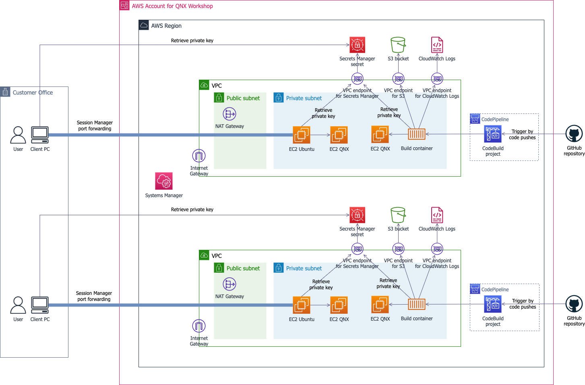

# BlackBerry QNX on AWS workshop <!-- omit in toc -->

- [Overview](#overview)
- [Architecture overview](#architecture-overview)
- [File structure](#file-structure)
- [Prerequisites](#prerequisites)
    - [AWS environment](#aws-environment)
        - [AWS account](#aws-account)
        - [AWS credentials](#aws-credentials)
        - [AWS region](#aws-region)
    - [Client PC](#client-pc)
    - [QNX software](#qnx-software)
        - [myQNX account and QNX product evaluation license](#myqnx-account-and-qnx-product-evaluation-license)
        - [QNX AMI subscription](#qnx-ami-subscription)
    - [GitHub repository](#github-repository)
- [Instructions](#instructions)
- [Security](#security)
- [License](#license)
- [References](#references)
    - [QNX 8.x](#qnx-8x)
    - [QNX 7.x](#qnx-7x)


## Overview

In the BlackBerry QNX on AWS workshop, you can easily get started with embedded software development on AWS Cloud. The workshop provides a hands-on lab experience to help customers quickly grasp embedded software development with QNX® OS on AWS.

In January 2023, BlackBerry Limited [announced the general availability](https://www.blackberry.com/us/en/company/newsroom/press-releases/2023/blackberry-introduces-qnx-accelerate-announces-global-availability-of-blackberry-qnx-rtos-and-qnx-os-for-safety-in-aws-marketplace) of the following QNX Operating Systems on AWS via the AWS Marketplace:

* [QNX® Neutrino® Real Time Operating System (RTOS) 7.1](https://aws.amazon.com/marketplace/pp/prodview-wjqoq2mq7hrhc)
* [QNX® OS for Safety 2.2.3](https://aws.amazon.com/marketplace/pp/prodview-26pvihq76slfa)

In May 2024, BlackBerry [announced availability](https://www.edaway.com/2024/03/18/qnx-8-0-cloud/) of the following QNX Operating System.

* [QNX OS 8.0](https://aws.amazon.com/marketplace/pp/prodview-fyhziqwvrksrw)


BlackBerry® QNX® has been widely used to build mission-critical embedded systems across industries such as automotive, robotics, aerospace, avionics, energy and medical.

With the combination of new QNX Amazon Machine Image (AMI) and Amazon EC2 instances powered by AWS Graviton Processors (an Arm-based processor developed by AWS), AWS customers can use the agility, flexibility and scalability of the AWS Cloud to support their embedded software development.


This repository provides the workshop package and quick instructions to build the base environment for the workshop. For the full instructions, please refer to [BlackBerry QNX on AWS workshop](https://catalog.workshops.aws/qnx-on-aws).


## Architecture overview

In the workshop, we will deploy AWS resources based on the following architecture.




* AWS account, users and resources
    * The workshop resources are deployed in a single AWS account.
    * Each user in the AWS account is authenticated by a unique user ID.
    * The workshop deploys resources such as VPC, EC2 Ubuntu instance, EC2 QNX instance etc. for each user.
* QNX development host
    * If you choose to use the EC2 development host (QNX SDP installed on an EC2 instance), each user securely establishes a connection with SSM port forwarding using Session Manager, and logs into Ubuntu Linux using Remote Desktop client from the client PC. EC2 Ubuntu instance private key is securely managed in a Secrets Manager secret.
    * If you choose to use the local development host (QNX SDP installed on the client PC), each user logs into the client PC.
* QNX target
    * EC2 QNX instance (QNX target) is deployed in an isolated secure VPC network on AWS.
    * To securely access the EC2 QNX target, each user securely establishes a connection with SSM port forwarding using Session Manager, and logs into the EC2 QNX instance using SSH client. EC2 QNX instance private key is securely managed in a Secrets Manager secret.
* CI pipeline
    * The workshop creates CodeBuild project, CodePipeline pipeline and VPC endpoints to run Continuous Integration (CI) pipeline with EC2 QNX instances.
    * CodeBuild container deploys CI pipeline resources such as EC2 QNX instances, and runs pre-defined CI tasks. It automatically destroys the created resources once the CI tasks are completed.


## File structure

Some important files are listed below.

```shell
qnx-on-aws-workshop/
├── .gitignore                          # Git ignore configuration
├── CODE_OF_CONDUCT.md                  # Code of conduct guidelines
├── CONTRIBUTING.md                     # Contributing guidelines
├── LICENSE                             # License file
├── README-ja.md                        # README file (Japanese)
├── README.md                           # README file (English)
├── docs/                               # Documentation files
│   ├── INSTRUCTIONS-ja.md              # Workshop instructions (Japanese)
│   ├── INSTRUCTIONS.md                 # Workshop instructions (English)
│   └── image/                          # Image files for documentation
├── github-example-repo/                # CodeBuild files stored in GitHub repository
│   ├── .gitignore                      # Git ignore configuration for CI repository
│   ├── app/
│   │   └── run_command.sh              # Sample CI application
│   ├── arguments.txt                   # List of arguments passed to CI application
│   ├── buildspec.yaml                  # Build specification for CodeBuild
│   ├── ec2-qnx.tf                      # Terraform configurations for EC2 QNX instance in CI pipeline
│   ├── main.tf                         # Main Terraform configurations for CI pipeline
│   ├── src/
│   │   └── get_primes.c                # Sample CI application source
│   └── variables.tf                    # Terraform variable configurations for CI pipeline
├── simple-qnx-cockpit/                 # Simple QNX cockpit application
│   ├── .gitignore                      # Git ignore configuration for cockpit application
│   ├── Makefile                        # Build configuration
│   ├── README-ja.md                    # README file (Japanese)
│   ├── README.md                       # README file (English)
│   └── cockpit.cpp                     # Main cockpit application source code
└── terraform/                          # Terraform configurations for base environment
    ├── .tool-versions                  # Tool version specifications
    ├── codex.tf                        # Terraform configurations for AWS developer tools
    ├── ec2-qnx.tf                      # Terraform configurations for EC2 QNX instance
    ├── ec2-ubuntu.tf                   # Terraform configurations for EC2 Ubuntu instance
    ├── keys_and_secrets.tf             # Terraform configurations for EC2 key pair, secrets and KMS
    ├── main.tf                         # Main Terraform configurations for base environment
    ├── output.tf                       # Terraform configurations for output values
    ├── script/
    │   └── user_data_script_ubuntu.sh  # User data script for EC2 Ubuntu instance
    ├── terraform.tfvars.template       # Terraform variable file template
    ├── variables.tf                    # Terraform configurations for input variables
    └── vpc.tf                          # Terraform configurations for VPC
```


## Prerequisites

### AWS environment

#### AWS account

We will use a customer own AWS account for the workshop. If you don’t have an AWS account with the administrator access yet, create one by [clicking here](https://portal.aws.amazon.com/billing/signup#/start/email).


#### AWS credentials

For the workshop, you will run as a user with administrative privileges on your AWS account. Make sure you have access to the AWS credentials of a user with administrative privileges.


#### AWS region

The workshop is designed to run in the following AWS regions.

| AWS Region name          | Region code      |
| :----------------------- | :--------------- |
| Asia Pacific (Tokyo)     | `ap-northeast-1` |
| Asia Pacific (Seoul)     | `ap-northeast-2` |
| Asia Pacific (Singapore) | `ap-southeast-1` |
| Europe (Frankfurt)       | `eu-central-1`   |
| Europe (Ireland)         | `eu-west-1`      |
| US East (N. Virginia)    | `us-east-1`      |
| US West (Oregon)         | `us-west-2`      |


### Client PC

The followings are used in the client PC environment.

* macOS or Linux or Windows OS
* Mozilla Firefox or Google Chrome
* SSH client
* Remote Desktop client
* AWS CLI version 2
* AWS CLI Session Manager plugin
* Terraform version 1.9.3 or higher

### QNX software

#### myQNX account and QNX product evaluation license

For the workshop, participants need to register [myQNX](https://blackberry.qnx.com/en) account. Please register your account and request the evaluation license for QNX SDP 8.0 before the workshop. As it may take some time to get a license, please request the license in advance. Refer to the following links to register myQNX account and request the evaluation license.

* [Register myQNX account](https://www.qnx.com/account/login.html?logout=1#showcreate)
* [Request evaluation license](https://www.qnx.com/products/evaluation/)

In the workshop, we will use the following QNX products with an evaluation license.

* QNX® Software Development Platform (SDP) 8.0
* QNX® Momentics® Integrated Development Environment (IDE)
* QNX® Software Center

#### QNX AMI subscription

In the workshop, we will use the following QNX product with AWS Marketplace subscription.

* QNX® OS 8.0

### GitHub repository

In the workshop, we use a GitHub repository for CI/CD. Please create a GitHub user, repository before the workshop. 


## Instructions

See [INSTRUCTIONS](docs/INSTRUCTIONS.md) for more detailed instructions.

## Security

See [CONTRIBUTING](CONTRIBUTING.md#security-issue-notifications) for more information.


## License

This library is licensed under the MIT-0 License. See the [LICENSE](LICENSE) file.


## References

### QNX 8.x

* [AWS Marketplace: QNX OS 8.0](https://aws.amazon.com/marketplace/pp/prodview-fyhziqwvrksrw)
* [QNX Amazon Machine Image Technotes](https://www.qnx.com/developers/docs/8.0/com.qnx.doc.qnxcloud.ami/topic/about_ami.html)
* [QNX Momentics IDE User's Guide](https://www.qnx.com/developers/docs/8.0/com.qnx.doc.ide.userguide/topic/about.html)
* [QNX® Software Development Platform 8.0](https://www.qnx.com/developers/docs/8.0/com.qnx.doc.qnxsdp.nav/topic/bookset.html)


### QNX 7.x

* [AWS Marketplace - QNX Neutrino RTOS 7.1](https://aws.amazon.com/marketplace/pp/prodview-wjqoq2mq7hrhc)
* [AWS Marketplace - QNX OS for Safety 2.2.3](https://aws.amazon.com/marketplace/pp/prodview-26pvihq76slfa)
* [AWS Blog "Accelerate embedded software development using QNX® Neutrino® OS on Amazon EC2 Graviton"(English)](https://aws.amazon.com/jp/blogs/industries/accelerate-embedded-software-development-using-qnx-os-on-amazon-ec2-graviton/)
* [AWS Blog "Accelerate embedded software development using QNX® Neutrino® OS on Amazon EC2 Graviton"(Japanese)](https://aws.amazon.com/jp/blogs/news/accelerate-embedded-software-development-using-qnx-os-on-amazon-ec2-graviton/)
* [Getting Started with QNX in the Cloud: QNX Amazon Machine Image 1.0.1](https://get.qnx.com/download/feature.html?programid=70060)
* [Create myQNX account](https://www.qnx.com/account/login.html?logout=1#showcreate)
* [QNX SDP 7.1 30-day Evaluation](https://www.qnx.com/products/evaluation/)
* [QNX Software Center 2.0](http://www.qnx.com/download/group.html?programid=29178)
* [QNX Software Center 2.0: Installation Notes](http://www.qnx.com/developers/articles/inst_6963_1.html)
* [QNX Momentics IDE User's Guide](https://www.qnx.com/developers/docs/7.1/#com.qnx.doc.ide.userguide/topic/about.html)
* [QNX Software Development Platform](https://www.qnx.com/developers/docs/7.1/#com.qnx.doc.qnxsdp.nav/topic/bookset.html)
* [QNX Training | Embedded Development and Product Training | BlackBerry QNX](https://blackberry.qnx.com/en/services/training)
