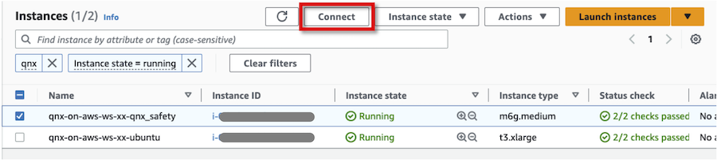
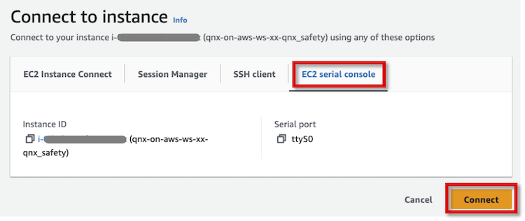
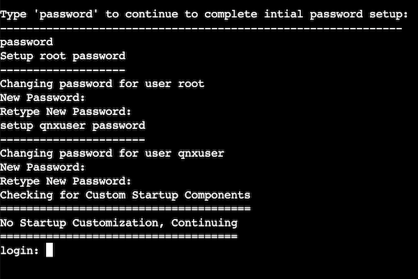
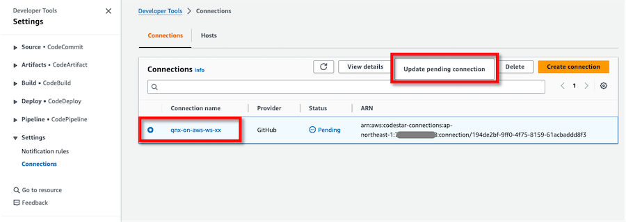

# 手順 <!-- omit in toc -->

[English](INSTRUCTIONS.md) | **日本語**

- [ワークショップ環境の準備](#ワークショップ環境の準備)
  - [ワークショップで使用する情報の準備](#ワークショップで使用する情報の準備)
  - [前提ソフトウェアのインストール](#前提ソフトウェアのインストール)
  - [QNX ソフトウェアの準備](#qnx-ソフトウェアの準備)
- [環境の設定とデプロイ](#環境の設定とデプロイ)
  - [AWS アカウントへのログイン](#aws-アカウントへのログイン)
  - [Git リポジトリのクローン](#git-リポジトリのクローン)
  - [環境の設定](#環境の設定)
  - [環境のデプロイ](#環境のデプロイ)
- [カスタム QNX AMI の作成](#カスタム-qnx-ami-の作成)
  - [カスタム QNX AMI の設定](#カスタム-qnx-ami-の設定)
  - [カスタム QNX AMI の作成](#カスタム-qnx-ami-の作成-1)
  - [新しい EC2 QNX インスタンスのデプロイ](#新しい-ec2-qnx-インスタンスのデプロイ)
- [Remote Desktop クライアントを使用した EC2 開発ホストへのログイン](#remote-desktop-クライアントを使用した-ec2-開発ホストへのログイン)
- [QNX SDP のインストールと開発](#qnx-sdp-のインストールと開発)
  - [QNX ソフトウェアのインストール](#qnx-ソフトウェアのインストール)
  - [QNX SDP での開発](#qnx-sdp-での開発)
- [VS Code と Amazon Q Developer での開発](#vs-code-と-amazon-q-developer-での開発)
- [AWS 開発者ツールでの CI の実行](#aws-開発者ツールでの-ci-の実行)
  - [CI/CD プロバイダーの選択](#cicd-プロバイダーの選択)
  - [オプション1: GitHub Actions セットアップ（デフォルト）](#オプション1-github-actions-セットアップデフォルト)
    - [GitHub リポジトリ変数の設定](#github-リポジトリ変数の設定)
    - [コードの準備と設定](#コードの準備と設定)
    - [GitHub Actions ワークフローの実行](#github-actions-ワークフローの実行)
  - [オプション2: AWS CodeBuild/CodePipeline セットアップ](#オプション2-aws-codebuildcodepipeline-セットアップ)
    - [GitHub への接続の更新](#github-への接続の更新)
    - [コードの準備と設定](#コードの準備と設定-1)
    - [CI パイプラインの実行](#ci-パイプラインの実行)
  - [CI/CD ワークフロー比較](#cicd-ワークフロー比較)


## ワークショップ環境の準備

### ワークショップで使用する情報の準備

ワークショップを開始する前に、以下の情報を準備してください。

* AWS 
    * AWS アカウント ID
    * AWS 認証情報
        * Management Console ログイン: ユーザー ID、パスワード
        * API/CLI: アクセスキー、シークレットアクセスキー、（セッショントークン）
    * AWS リージョン
* BlackBerry QNX
    * myQNX アカウント、パスワード
    * QNX SDP 8.x の評価ライセンス参照シリアル番号
* GitHub
    * GitHub ユーザー
    * GitHub リポジトリ
* 参加者ごとの一意の 2 桁の ID

| :exclamation: 参加者ごとに一意の 2 桁の ID を割り当てて使用してください |
|:---------------------------|
| ワークショップの手順で `xx` を、他のワークショップ参加者と重複しない 2 桁の ID に置き換えてください。この ID は、同じ AWS アカウント内の複数のユーザーでワークショップを実施する際のリソース名の競合を防ぎます。必ず 2 桁の ID を使用してください。より長い ID を使用するとエラーが発生する可能性があります。 |


### 前提ソフトウェアのインストール

以下の手順に従って各ソフトウェアをインストールしてください。

* AWS CLI version 2: [Installing or updating the latest version of the AWS CLI](https://docs.aws.amazon.com/cli/latest/userguide/getting-started-install.html)
* AWS CLI Session Manager plugin: [Install the Session Manager plugin for the AWS CLI](https://docs.aws.amazon.com/systems-manager/latest/userguide/session-manager-working-with-install-plugin.html)
* Terraform version 1.9.3 以上: [Install Terraform](https://developer.hashicorp.com/terraform/tutorials/aws-get-started/install-cli)


### QNX ソフトウェアの準備

QNX AMI は AWS Marketplace でサードパーティソフトウェアとして提供されています。ユーザーはサブスクリプションを通じて AWS インフラストラクチャ上でソフトウェアを使用できます。

管理者権限を持つユーザーとして AWS Management Console にログインし、AWS Marketplace で [AWS Marketplace: QNX OS 8.0](https://aws.amazon.com/marketplace/pp/prodview-fyhziqwvrksrw) をサブスクライブしてください。このページでは、製品概要、価格、使用情報、サポート情報などが提供されています。利用規約を読み、同意する場合は承諾してください。


## 環境の設定とデプロイ

### AWS アカウントへのログイン

Web ブラウザを起動し、管理者権限を持つユーザーとして AWS Management Console にログインしてください。

ターミナルを起動し、ターミナル上で AWS 認証情報を環境変数として設定してください。

```shell
export AWS_ACCESS_KEY_ID="<YOUR_AWS_ACCESS_KEY>"
export AWS_SECRET_ACCESS_KEY="<YOUR_AWS_SECRET_ACCESS_KEY>"
```

デフォルトで送信先とする AWS リージョンを指定するため、`AWS_DEFAULT_REGION` 環境変数にデフォルト AWS リージョンを設定してください。
```shell
export AWS_DEFAULT_REGION="<YOUR_AWS_REGION>"
```


### Git リポジトリのクローン

以下のコマンドを実行して git リポジトリをクローンしてください。

```
git clone https://github.com/aws-samples/qnx-on-aws-workshop.git
cd qnx-on-aws-workshop/
```


### 環境の設定

`terraform/terraform.tfvars.template` ファイルを `terraform/terraform.tfvars` にコピーしてください。

```shell
cp terraform/terraform.tfvars.template terraform/terraform.tfvars
```

`terraform/terraform.tfvars` の設定を更新してください。テンプレートファイルには、説明と例を含むすべての利用可能な設定オプションが含まれています。

**必須変数** - 設定が必要な項目:

```shell
# =============================================================================
# 必須設定
# =============================================================================

# プロジェクト識別子 - すべての AWS リソースの命名に使用
# 一意で 1-20 文字（文字、数字、ハイフンのみ）である必要があります
project_name = "qnx-on-aws-ws-xx"  # `xx`を2桁のIDに置き換えてください(例: "01", "02")

# すべてのリソースが作成される AWS リージョン
# ARMインスタンス(c7g/c8gファミリー)をサポートするリージョンを選択してください
aws_region = "ap-northeast-1"  # 例: us-east-1, us-west-2, eu-west-1, ap-northeast-1

# Ubuntu 'ubuntu' ユーザーのパスワード(最低8文字）
# AWS Secrets Managerに安全に保存されます
ubuntu_user_password = "YourStrongPassword123!"

# CI/CDパイプライン用GitHub設定
github_user = "your-github-username"    # あなたのGitHubユーザー名
github_repo = "your-repository-name"    # ワークショップコードを含むリポジトリ

# CI/CDパイプライン用CodeBuildプロジェクト名
build_project_name = "qnx-on-aws-ws-pl-xx"  # `xx`をproject_nameと同じIDに置き換えてください
```

**オプション変数** - カスタマイズ可能な項目（適切なデフォルト値が提供されています）:

```shell
# =============================================================================
# オプション設定 (適切なデフォルト値が提供されています)
# =============================================================================

# カスタムQNX AMI ID - デフォルトのQNX OS 8.0 AMIを使用する場合は空のままにしてください
qnx_custom_ami_id = ""

# VPCネットワーク設定 - ワークショップ環境用のプライベートIP範囲
vpc_cidr = "10.1.0.0/16"

# QNXインスタンスタイプ - QNX互換性のためARMベースのインスタンスが必要
# オプション: c7g.large, c7g.xlarge, c7g.2xlarge, c8g.large, c8g.xlargeなど
qnx_instance_type = "c7g.xlarge"

# Ubuntuインスタンスタイプ - 開発とクロスコンパイルに使用
# オプション: t3.large, t3.xlarge, t3.2xlarge, m5.large, m5.xlargeなど
ubuntu_instance_type = "t3.xlarge"

# Ubuntuルートディスクサイズ (GB)
ubuntu_root_volume_size = 20

# CI/CD環境用Terraformバージョン
terraform_version = "1.9.3"
```


### 環境のデプロイ

以下の terraform コマンドを実行して、ワークショップのベース環境をデプロイしてください。`terraform/` ディレクトリでコマンドを実行してください。

```shell
cd terraform/
terraform init
terraform plan
terraform apply --auto-approve
```


## カスタム QNX AMI の作成

デフォルトの QNX AMI では、ログインパスワードとサービスの自動開始が設定されていません。EC2 QNX インスタンスを初回起動する際のみ、EC2 シリアルコンソールから QNX OS にログインして環境を設定します。環境設定後、新しいカスタム QNX AMI を作成します。新しいカスタム QNX AMI を使用して EC2 QNX インスタンスを起動できます。

### カスタム QNX AMI の設定


EC2 Console から対応する EC2 QNX インスタンスを選択し、**Connect** をクリックしてください。



次の画面で **EC2 serial console** タブを選択し、**Connect** をクリックして QNX OS にログインしてください。



Enter キーを押して `password` と入力すると、初期パスワード設定プロンプトが表示されます。`root` ユーザーと `qnxuser` ユーザーのデフォルトログインパスワードをそれぞれ設定できます。




`root` ユーザーとしてログインし、以下のコマンドを実行して QNX OS 起動時の `qconn` デーモン自動開始を設定してください。

```shell
login: root
Password: <ENTER ROOT PASSWORD>
```

```shell
# Add qconn daemon to startup script for automatic launch on boot
echo qconn >> /var/start_script.sh

# Enable root SSH login
cp /etc/ssh/sshd_config /etc/ssh/sshd_config.bak && awk '/^[[:space:]]*PermitRootLogin[[:space:]]+no/ {gsub(/no/, "yes"); print; next} {print}' /etc/ssh/sshd_config.bak > /tmp/sshd_config.tmp && mv /tmp/sshd_config.tmp /etc/ssh/sshd_config
```


| :exclamation: 重要 |
|:---------------------------|
| QNX SDP は qconn デーモンを使用して QNX OS へのアクセスを許可します。EC2 QNX インスタンスのセキュリティグループで、開発ホストからの接続を許可するカスタム TCP としてポート 8000 を開放することが重要です。qconn を使用すると、ユーザーは認証なしで QNX OS にログインでき、QNX OS 上のファイルにアクセスできます。QNX OS 環境を保護するため、セキュリティグループと Network ACL を使用して限定された開発ホスト以外からのすべてのアクセスを拒否することを強く推奨します。ワークショップでは、qconn へのアクセスは EC2 Ubuntu インスタンスからのみ許可されています。qconn デーモンの詳細については、[qconn](https://www.qnx.com/developers/docs/8.0/com.qnx.doc.neutrino.utilities/topic/q/qconn.html) を参照してください。|


### カスタム QNX AMI の作成

以下のコマンドを実行してカスタム QNX AMI を作成してください。`xx` を 2 桁の ID に置き換えてください（例: `qnx-custom-01`）。

```shell
AMI_NAME="qnx-custom-xx"
INSTANCE_ID=$(terraform output -raw ec2_instance_qnx_instance_id)
aws ec2 create-image --instance-id ${INSTANCE_ID} --name ${AMI_NAME} --tag-specifications "ResourceType=image,Tags=[{Key=Name,Value=${AMI_NAME}}]"
```

出力例:

```shell
$ AMI_NAME="qnx-custom"
$ INSTANCE_ID=$(terraform output -raw ec2_instance_qnx_instance_id)
$ aws ec2 create-image --instance-id ${INSTANCE_ID} --name ${AMI_NAME} --tag-specifications "ResourceType=image,Tags=[{Key=Name,Value=${AMI_NAME}}]"
{
    "ImageId": "ami-04f6f6c2a180cd137"
}
```

`aws ec2 describe-images` コマンドを実行して AMI 作成の進行状況を確認してください。AMI ID を上記で表示された新しい AMI ID に置き換えて、以下のコマンドを実行してください。`State` が `available` の場合、カスタム QNX AMI の作成が完了しています。

```shell
$ aws ec2 describe-images --image-ids ami-04f6f6c2a180cd137
{
    "Images": [
        {
            "Architecture": "arm64",
            "CreationDate": "2023-03-25T11:50:25.000Z",
            "ImageId": "ami-04f6f6c2a180cd137",
            "ImageLocation": "123456789012/qnx-custom",
            "ImageType": "machine",
            "Public": false,
            "OwnerId": "123456789012",
            "PlatformDetails": "Linux/UNIX",
            "UsageOperation": "RunInstances",
            "ProductCodes": [
                {
                    "ProductCodeId": "1243xbs6brm8b7j5r3nfbm9n4",
                    "ProductCodeType": "marketplace"
                }
            ],
            "State": "available",
##### 省略 #####
        }
    ]
}
```

### 新しい EC2 QNX インスタンスのデプロイ

`terraform/terraform.tfvars` でカスタム QNX AMI ID を更新してください。`qnx_custom_ami_id` 変数に、新しく作成した AMI ID を設定してください:

```shell
# =============================================================================
# オプション設定 (適切なデフォルト値が提供されています)
# =============================================================================

# カスタムQNX AMI ID - デフォルトのQNX OS 8.0 AMIを使用する場合は空のままにしてください
qnx_custom_ami_id = "<YOUR_CUSTOM_AMI_ID>"  # カスタムQNX OS AMI
```

以下の terraform コマンドを実行して、古い EC2 QNX インスタンスを終了し、新しく作成したカスタム QNX AMI で新しい EC2 QNX インスタンスをデプロイしてください。新しい EC2 QNX インスタンスのデプロイには約 5 分かかります。

```shell
terraform plan
terraform apply --auto-approve
```

## Remote Desktop クライアントを使用した EC2 開発ホストへのログイン

SSM ポートフォワーディングを使用して、クライアント PC から EC2 開発ホストへのポートフォワーディングを実行し、安全なトンネルを確立してください。

```shell
aws ssm start-session \
  --region $(terraform output -raw aws_region) \
  --target $(terraform output -raw ec2_instance_ubuntu_instance_id) \
  --document-name AWS-StartPortForwardingSession \
  --parameters '{"portNumber":["3389"],"localPortNumber":["33890"]}'
```

Remote Desktop クライアントで EC2 開発ホストに接続してログインしてください。

* Remote Desktop クライアントアプリケーションを開いてください。
* `127.0.0.1:33890` に接続してください。
* ユーザー名 `ubuntu` と `terraform.tfvar` ファイルで指定したのと同じ値のパスワードを入力してください。
* リモートホストの身元に関する警告を無視してください。
* プロンプトが表示された場合は、再度パスワードを入力してください。


## QNX SDP のインストールと開発

開発ホストに QNX ソフトウェアをインストールして使用します。

### QNX ソフトウェアのインストール

* [QNX Software Center 2.0](http://www.qnx.com/download/group.html?programid=29178)
* [QNX® Software Development Platform 8.0](https://www.qnx.com/developers/docs/8.0/com.qnx.doc.qnxsdp.nav/topic/bookset.html)
* [QNX Momentics IDE User's Guide](https://www.qnx.com/developers/docs/8.0/com.qnx.doc.ide.userguide/topic/about.html)

### QNX SDP での開発

上記の QNX ドキュメントを参照してください。さらに高度な QNX 開発について学習したい場合は、[QNX Training | Embedded Development and Product Training](https://blackberry.qnx.com/en/services/training) を参照してください。


## VS Code と Amazon Q Developer での開発

効率的な QNX アプリケーション開発のために、QNX Toolkit 拡張機能を備えた Visual Studio Code と Amazon Q Developer を含むモダンな開発ツールを使用します。

シンプルな QNX コックピットアプリケーションを使用して、VS Code でのクロスプラットフォーム QNX 開発を実演します。ワークショップでは、Amazon Q Developer を使用したコードの理解、自動ビルドとデプロイメント、Linux と QNX ターゲット間のクロスプラットフォーム互換性について説明します。

詳細な手順については、完全なワークショップ手順を[BlackBerry QNX on AWS ワークショップ](https://catalog.workshops.aws/qnx-on-aws/ja-JP)から参照してください。


## AWS 開発者ツールでの CI の実行

GitHub、CodeBuild、CodePipeline などの開発者ツールを使用して、EC2 QNX インスタンスで CI プロセスを自動化する方法を実演します。


### GitHub への接続の更新

## AWS 開発者ツールでの CI の実行

AWS CodeBuild/CodePipeline または GitHub Actions を使用して、EC2 QNX インスタンスでの CI プロセスを自動化する方法を実演します。ワークショップでは両方のアプローチをサポートしており、ニーズに最適な CI/CD ソリューションを選択できます。

### CI/CD プロバイダーの選択

ワークショップでは2つのCI/CDオプションをサポートしています：

1. **GitHub Actions**（デフォルト）: AWS OIDC認証を使用したGitHubネイティブCI/CD
2. **AWS CodeBuild/CodePipeline**: 深いAWS統合を持つフルマネージドAWSサービス

`terraform/terraform.tfvars` で選択を設定してください：

```shell
# CI/CD設定
ci_cd_provider = "github-actions"   # GitHub Actionsを使用（デフォルト）
# ci_cd_provider = "codebuild"      # AWS CodeBuild/CodePipelineを使用
```

### オプション1: GitHub Actions セットアップ（デフォルト）

#### GitHub リポジトリ変数の設定

GitHub Actions を使用する場合、Terraform が必要なリポジトリ変数を**自動的に作成**します。認証用のGitHubトークンを提供するだけで済みます。

**ステップ1: GitHub Personal Access Token の作成**

1. GitHub → **Settings** → **Developer settings** → **Personal access tokens** → **Tokens (classic)** に移動
2. **Generate new token (classic)** をクリック
3. 説明的な名前を付けます（例: "QNX Workshop Terraform"）
4. **repo** スコープを選択（プライベートリポジトリの完全制御）
5. **Generate token** をクリックしてトークンをコピー

**ステップ2: GitHub トークンの設定**

環境変数としてトークンを設定します（推奨）：
```shell
export GITHUB_TOKEN="your_github_personal_access_token_here"
```

**ステップ3: インフラストラクチャのデプロイ**

`ci_cd_provider = "github-actions"` でインフラストラクチャをデプロイした後、Terraform が必要なリポジトリ変数を自動的に作成します：

```shell
terraform apply
```

以下の変数がGitHubリポジトリに自動的に作成されます：
- `AWS_REGION` - AWSリージョン
- `AWS_ROLE_ARN` - OIDC認証用GitHub Actions IAMロールARN
- `BUILD_PROJECT_NAME` - ビルドプロジェクト名
- `QNX_CUSTOM_AMI_ID` - カスタムQNX AMI ID
- `VPC_ID` - TerraformからのVPC ID
- `PRIVATE_SUBNET_ID` - プライベートサブネットID
- `VPC_CIDR_BLOCK` - VPC CIDRブロック
- `KEY_PAIR_NAME` - EC2キーペア名
- `PRIVATE_KEY_SECRET_ID` - Secrets Managerシークレット ID
- `KMS_KEY_ID` - KMSキーID
- `TF_VERSION` - Terraformバージョン
- `TF_BACKEND_S3` - Terraform状態用S3バケット

**手動での変数設定は不要です！** ✨

#### コードの準備と設定

`terraform/` ディレクトリで以下のコマンドを実行して、GitHubリポジトリをクローンし、ワークショップファイルをコピーしてください：

```shell
REPO_URL=$(terraform output -raw github_repository_url)
REPO_NAME=$(terraform output -raw github_repository_name)
cd ~
git clone ${REPO_URL}
cd ./${REPO_NAME}
```

GitHub Actions ワークフローを含むすべてのファイルをコピー：

```shell
cp -a <WORKSHOP_DIR>/github-example-repo/* ./
cp -a <WORKSHOP_DIR>/github-example-repo/.github ./
```

#### GitHub Actions ワークフローの実行

変更をGitHubリポジトリにコミットしてプッシュしてください。これによりGitHub Actionsワークフローがトリガーされ、EC2 QNXインスタンスをデプロイして定義されたタスクを実行します。

```shell
git add -A
git commit -m "Add GitHub Actions CI/CD pipeline"
git push origin main
```

GitHubリポジトリ → **Actions** タブに移動してワークフローの実行を監視してください。

### オプション2: AWS CodeBuild/CodePipeline セットアップ

#### GitHub への接続の更新

AWS CodePipeline が GitHub リポジトリに接続できるようにするため、接続を手動で更新する必要があります。これは GitHub アカウントに AWS Connector for GitHub をインストールすることで実行できます。

Developer Tools コンソールで **Settings** > **Connections** に移動してください。terraform デプロイの一部としてデプロイした接続（例: `qnx-on-aws-ws-xx`）を選択し、**Update pending connection** をクリックしてください。



次の画面で **Install a new app** をクリックすると、GitHub ページにリダイレクトされます。その後、[Create a connection to GitHub](https://docs.aws.amazon.com/dtconsole/latest/userguide/connections-create-github.html#connections-create-github-console) の関連手順に従って、GitHub リポジトリへの接続を設定してください。正常に更新されると、接続のステータスが `Available` と表示されます。

#### コードの準備と設定

`terraform/` ディレクトリで以下のコマンドを実行して、空の GitHub リポジトリをホームディレクトリにクローンしてください。**`xx` を 2 桁の ID に置き換えてください**（例: `qnx-on-aws-ws-01-hello-world`）。

```shell
REPO_URL=$(terraform output -raw github_repository_url)
REPO_NAME=$(terraform output -raw github_repository_name)
cd ~
git clone ${REPO_URL}
cd ./${REPO_NAME}
```

ワークショップパッケージの `github-example-repo/` ディレクトリ内のすべてのファイルを、クローンしたローカルリポジトリにコピーしてください。

```shell
cp -a <WORKSHOP_DIR>/github-example-repo/* ./
```

#### CI パイプラインの実行

変更を GitHub リポジトリにコミットしてプッシュしてください。リポジトリに新しい変更をプッシュすると、CodePipeline パイプラインがトリガーされ、CodeBuild プロジェクトが開始されます。プロジェクトは EC2 QNX インスタンスをデプロイし、`buildspec.yaml` で定義されたコマンドを実行します。

```shell
git add -A
git commit -m "Initial commit" 
git push origin main
```

リージョンの [CodePipeline console](https://console.aws.amazon.com/codesuite/codepipeline/pipelines) に移動し、パイプライン名（例: `qnx-on-aws-ws-01`）をクリックして詳細な進行状況を確認してください。

### CI/CD ワークフロー比較

| 機能 | GitHub Actions | CodeBuild/CodePipeline |
|------|----------------|------------------------|
| **セットアップ** | リポジトリ変数が必要 | GitHub接続が必要 |
| **監視** | GitHub Actions UI | AWSコンソール |
| **設定** | `.github/workflows/qnx-ci.yml` | `buildspec.yaml` |
| **トリガー** | ネイティブGitHubトリガー | GitHubウェブフック |
| **コスト** | GitHub Actions分数 | AWS CodeBuild料金 |
| **デフォルト選択** | ✓ 推奨 | 代替案 |

両方のアプローチで同じ機能を提供：
- 一時的なQNX EC2インスタンスをデプロイ
- QNXターゲット上でアプリケーションを実行
- リソースを自動的にクリーンアップ
- セキュアな認証とアクセス制御

詳細なセットアップ手順とトラブルシューティングについては、[CI/CDセットアップガイド](../github-example-repo/README-CI-SETUP.md) を参照してください。
