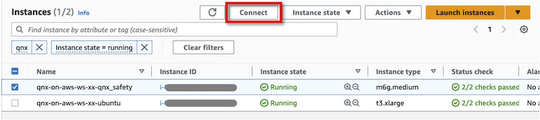
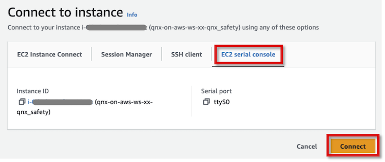
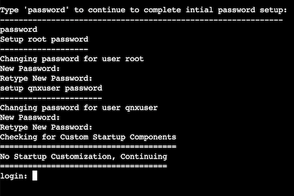
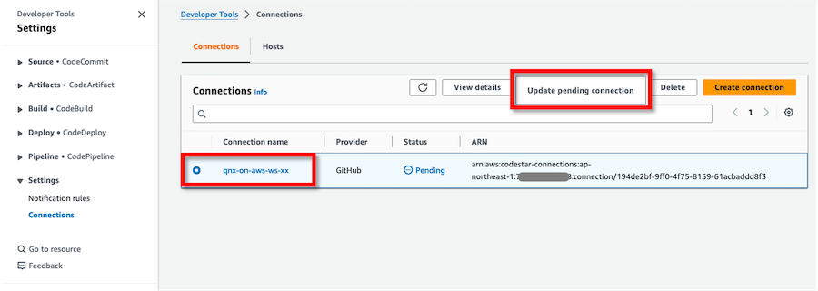

# Instructions <!-- omit in toc -->

**English** | [日本語](INSTRUCTIONS-ja.md)

- [Prepare workshop environment](#prepare-workshop-environment)
  - [Prepare information used in the workshop](#prepare-information-used-in-the-workshop)
  - [Install prerequisite software](#install-prerequisite-software)
  - [Prepare QNX software](#prepare-qnx-software)
- [Configure and deploy the environment](#configure-and-deploy-the-environment)
  - [Log in to an AWS account](#log-in-to-an-aws-account)
  - [Clone Git repository](#clone-git-repository)
  - [Configure the environment](#configure-the-environment)
  - [Deploy the environment](#deploy-the-environment)
- [Create custom QNX AMI](#create-custom-qnx-ami)
  - [Configure a custom QNX AMI](#configure-a-custom-qnx-ami)
  - [Create a custom QNX AMI](#create-a-custom-qnx-ami)
  - [Deploy a new EC2 QNX instance](#deploy-a-new-ec2-qnx-instance)
- [Log in to EC2 development host using Remote Desktop client](#log-in-to-ec2-development-host-using-remote-desktop-client)
- [Install and develop with QNX SDP](#install-and-develop-with-qnx-sdp)
  - [Install QNX Software](#install-qnx-software)
  - [Develop with QNX SDP](#develop-with-qnx-sdp)
- [Develop with VS Code and Amazon Q Developer](#develop-with-vs-code-and-amazon-q-developer)
- [Run CI with AWS developer tools](#run-ci-with-aws-developer-tools)
  - [Choose your CI/CD provider](#choose-your-cicd-provider)
  - [Option 1: GitHub Actions Setup (Default)](#option-1-github-actions-setup-default)
    - [Configure GitHub repository variables](#configure-github-repository-variables)
    - [Prepare and configure the code](#prepare-and-configure-the-code)
    - [Execute a GitHub Actions workflow](#execute-a-github-actions-workflow)
  - [Option 2: AWS CodeBuild/CodePipeline Setup](#option-2-aws-codebuildcodepipeline-setup)
    - [Update a connection to GitHub](#update-a-connection-to-github)
    - [Prepare and configure the code](#prepare-and-configure-the-code-1)
    - [Execute a CI pipeline](#execute-a-ci-pipeline)
  - [CI/CD Workflow Comparison](#cicd-workflow-comparison)


## Prepare workshop environment

### Prepare information used in the workshop

Please make sure you have the following information before working on the workshop.

* AWS 
    * AWS account ID
    * AWS credentials
        * Management Console login: User ID, Password
        * API/CLI: Access key, Secret access key, (Session token)
    * AWS region
* BlackBerry QNX
    * myQNX Account, Password
    * Evaluation license reference serial number of QNX SDP 8.x
* GitHub
    * GitHub user
    * GitHub repository
* Unique 2-digit ID per participant

| :exclamation: Assign and use a unique 2-digit ID per participant |
|:---------------------------|
| Replace `xx` in the workshop steps with a 2-digit ID that is not identical to any other workshop participants. The ID will prevent resource name conflicts during the workshop with multiple users in the same AWS account. Please be sure to use a 2-digit ID. Using a longer ID could cause errors. |


### Install prerequisite software

Follow the instruction below to install each software.

* AWS CLI version 2: [Installing or updating the latest version of the AWS CLI](https://docs.aws.amazon.com/cli/latest/userguide/getting-started-install.html)
* AWS CLI Session Manager plugin: [Install the Session Manager plugin for the AWS CLI](https://docs.aws.amazon.com/systems-manager/latest/userguide/session-manager-working-with-install-plugin.html)
* Terraform version 1.9.3 or higher: [Install Terraform](https://developer.hashicorp.com/terraform/tutorials/aws-get-started/install-cli)


### Prepare QNX software

QNX AMIs are provided as third party software in AWS Marketplace. Users can use the software on their AWS infrastructure through subscription.

Log in to AWS Management Console as a user with the administrative permissions, and then subscribe to [AWS Marketplace: QNX OS 8.0](https://aws.amazon.com/marketplace/pp/prodview-fyhziqwvrksrw) in AWS Marketplace. The page provides the product overview, pricing, usage information, and support information etc. Read the Terms and Conditions, and accept if you agree to proceed.


## Configure and deploy the environment

### Log in to an AWS account

Launch a web browser and log in to the AWS Management Console as a user with administrative privileges.

Launch a terminal and set the AWS credentials as environment variables on the terminal.

```shell
export AWS_ACCESS_KEY_ID="<YOUR_AWS_ACCESS_KEY>"
export AWS_SECRET_ACCESS_KEY="<YOUR_AWS_SECRET_ACCESS_KEY>"
```

Set default AWS region to `AWS_DEFAULT_REGION` environment variable to specify the AWS Region you want to send your requests to by default.
```shell
export AWS_DEFAULT_REGION="<YOUR_AWS_REGION>"
```


### Clone Git repository

Run the command below to clone the git repository.

```
git clone https://github.com/aws-samples/qnx-on-aws-workshop.git
cd qnx-on-aws-workshop/
```


### Configure the environment

Copy `terraform/terraform.tfvars.template` file to `terraform/terraform.tfvars`.

```shell
cp terraform/terraform.tfvars.template terraform/terraform.tfvars
```

Update configurations in `terraform/terraform.tfvars`. The template file contains all available configuration options with descriptions and examples.

**Required variables** that must be configured:

```shell
# =============================================================================
# REQUIRED CONFIGURATION
# =============================================================================

# Project identifier - used for naming all AWS resources
# Must be unique and 1-20 characters (letters, numbers, hyphens only)
project_name = "qnx-on-aws-ws-xx"  # Replace `xx` with your 2-digit ID (e.g., "01", "02")

# AWS region where all resources will be created
# Choose a region that supports ARM instances (c7g/c8g family)
aws_region = "ap-northeast-1"  # Examples: us-east-1, us-west-2, eu-west-1, ap-northeast-1

# Password for Ubuntu 'ubuntu' user (minimum 8 characters)
# Will be stored securely in AWS Secrets Manager
ubuntu_user_password = "YourStrongPassword123!"

# GitHub configuration for CI/CD pipeline
github_user = "your-github-username"    # Your GitHub username
github_repo = "your-repository-name"    # Repository containing workshop code

# CodeBuild project name for CI/CD pipeline
build_project_name = "qnx-on-aws-ws-pl-xx"  # Replace `xx` with same ID as project_name
```

**Optional variables** that can be customized (defaults will be used if not specified):

```shell
# =============================================================================
# OPTIONAL CONFIGURATION (sensible defaults provided)
# =============================================================================

# Custom QNX AMI ID - leave empty to use default QNX OS 8.0 AMI
qnx_custom_ami_id = ""

# VPC network configuration - private IP range for workshop environment
vpc_cidr = "10.1.0.0/16"

# QNX instance type - ARM-based instances required for QNX compatibility
# Options: c7g.large, c7g.xlarge, c7g.2xlarge, c8g.large, c8g.xlarge, etc.
qnx_instance_type = "c7g.xlarge"

# Ubuntu instance type - used for development and cross-compilation
# Options: t3.large, t3.xlarge, t3.2xlarge, m5.large, m5.xlarge, etc.
ubuntu_instance_type = "t3.xlarge"

# Ubuntu root disk size in GB
ubuntu_root_volume_size = 20

# Terraform version for CI/CD environment
terraform_version = "1.9.3"
```


### Deploy the environment

Run the following terraform commands to deploy the base environment for the workshop. Make sure to run the command in `terraform/` directory.

```shell
cd terraform/
terraform init
terraform plan
terraform apply --auto-approve
```


## Create custom QNX AMI

With the default QNX AMI, login passwords and service auto-start are not configured. Only for the first time EC2 QNX instance is launched, we will log in to QNX OS from EC2 serial console and configure the environment. After configuring the environment, we will create a new custom QNX AMI. We can launch EC2 QNX instances using the new custom QNX AMI.

### Configure a custom QNX AMI


Choose a corresponding EC2 QNX instance from EC2 Console, and click **Connect**.



Choose **EC2 serial console** tab in the following screen, then click **Connect** to log in QNX OS.



Press Enter key and type `password`, then the initial password setup prompt will be displayed. Then you can set the default login passwords for `root` user and `qnxuser` user, respectively.




Log in as `root` user, then run the command below to configure `qconn` daemon auto-start at QNX OS launch.

```shell
login: root
Password: <ENTER ROOT PASSWORD>
```

```shell
# Add qconn daemon to startup script for automatic launch on boot
echo qconn >> /var/start_script.sh

# Enable root SSH login
cp /etc/ssh/sshd_config /etc/ssh/sshd_config.bak && awk '/^[[:space:]]*PermitRootLogin[[:space:]]+no/ {gsub(/no/, "yes"); print; next} {print}' /etc/ssh/sshd_config.bak > /tmp/sshd_config.tmp && mv /tmp/sshd_config.tmp /etc/ssh/sshd_config
```


| :exclamation: Important |
|:---------------------------|
| QNX SDP uses qconn daemon to allow access to QNX OS. It is important that the security group of EC2 QNX instance has port 8000 open as Custom TCP allowing access for the development host to connect. With qconn, a user can log in to QNX OS without authentication and can gain access to files on QNX OS. To protect QNX OS environment, we strongly recommend to deny all accesses except from limited development hosts using security group and Network ACL. In the workshop, the access to qconn is only allowed from EC2 Ubuntu instance. See [qconn](https://www.qnx.com/developers/docs/8.0/com.qnx.doc.neutrino.utilities/topic/q/qconn.html) for further details of qconn daemon.|


### Create a custom QNX AMI

Run following commands to create custom QNX AMI. Replace `xx` with your 2-digit ID (e.g. `qnx-custom-01`). 

```shell
AMI_NAME="qnx-custom-xx"
INSTANCE_ID=$(terraform output -raw ec2_instance_qnx_instance_id)
aws ec2 create-image --instance-id ${INSTANCE_ID} --name ${AMI_NAME} --tag-specifications "ResourceType=image,Tags=[{Key=Name,Value=${AMI_NAME}}]"
```

Example output:

```shell
$ AMI_NAME="qnx-custom"
$ INSTANCE_ID=$(terraform output -raw ec2_instance_qnx_instance_id)
$ aws ec2 create-image --instance-id ${INSTANCE_ID} --name ${AMI_NAME} --tag-specifications "ResourceType=image,Tags=[{Key=Name,Value=${AMI_NAME}}]"
{
    "ImageId": "ami-04f6f6c2a180cd137"
}
```

Run `aws ec2 describe-images` command to check the progress of creating AMI. Replace AMI ID with your new AMI ID shown above, then run the following command. If `State` is `available`, the creation of your custom QNX AMI is completed.

```shell
$ aws ec2 describe-images --image-ids ami-04f6f6c2a180cd137
{
    "Images": [
        {
            "Architecture": "arm64",
            "CreationDate": "2023-03-25T11:50:25.000Z",
            "ImageId": "ami-04f6f6c2a180cd137",
            "ImageLocation": "123456789012/qnx-custom",
            "ImageType": "machine",
            "Public": false,
            "OwnerId": "123456789012",
            "PlatformDetails": "Linux/UNIX",
            "UsageOperation": "RunInstances",
            "ProductCodes": [
                {
                    "ProductCodeId": "1243xbs6brm8b7j5r3nfbm9n4",
                    "ProductCodeType": "marketplace"
                }
            ],
            "State": "available",
##### Omit #####
        }
    ]
}
```

### Deploy a new EC2 QNX instance

Update your custom QNX AMI ID in `terraform/terraform.tfvars`. Set the `qnx_custom_ami_id` variable with your newly created AMI ID:

```shell
# =============================================================================
# OPTIONAL CONFIGURATION (sensible defaults provided)
# =============================================================================

# Custom QNX AMI ID - leave empty to use default QNX OS 8.0 AMI
qnx_custom_ami_id = "<YOUR_CUSTOM_AMI_ID>"  # Custom QNX OS AMI
```


Run the following terraform commands to terminate old EC2 QNX instance and deploy a new EC2 QNX instance with the newly created custom QNX AMI. It takes about 5 minutes to deploy an new EC2 QNX instance.

```shell
terraform plan
terraform apply --auto-approve
```

## Log in to EC2 development host using Remote Desktop client

Use the SSM port forwarding to run port forwarding from the client PC to EC2 development host and establish a secure tunnel.

```shell
aws ssm start-session \
  --region $(terraform output -raw aws_region) \
  --target $(terraform output -raw ec2_instance_ubuntu_instance_id) \
  --document-name AWS-StartPortForwardingSession \
  --parameters '{"portNumber":["3389"],"localPortNumber":["33890"]}'
```

Connect and log in to the EC2 development host with the Remote Desktop client.

* Open the Remote Desktop client application.
* Connect to `127.0.0.1:33890`.
* Enter user name `ubuntu` and password with the same value as specified in `terraform.tfvar` file.
* Dismiss the warning about the identity of the remote host.
* Enter the password again if prompted.


## Install and develop with QNX SDP

We install and use QNX software on the development host.

### Install QNX Software

* [QNX Software Center 2.0](http://www.qnx.com/download/group.html?programid=29178)
* [QNX® Software Development Platform 8.0](https://www.qnx.com/developers/docs/8.0/com.qnx.doc.qnxsdp.nav/topic/bookset.html)
* [QNX Momentics IDE User's Guide](https://www.qnx.com/developers/docs/8.0/com.qnx.doc.ide.userguide/topic/about.html)

### Develop with QNX SDP

Please refer to QNX documentations above. If you want to learn further advanced QNX development, please refer to [QNX Training | Embedded Development and Product Training](https://blackberry.qnx.com/en/services/training).


## Develop with VS Code and Amazon Q Developer

We use modern development tools including Visual Studio Code with QNX Toolkit extension and Amazon Q Developer for efficient QNX application development.

We demonstrate cross-platform QNX development using VS Code with a simple QNX cockpit application. The workshop covers code understanding with Amazon Q Developer, automated build and deployment, and cross-platform compatibility between Linux and QNX targets.

Please refer to the full workshop instructions for detailed steps at [BlackBerry QNX on AWS workshop](https://catalog.workshops.aws/qnx-on-aws).


## Run CI with AWS developer tools

We will demonstrate how to automate CI processes with EC2 QNX instances using either AWS CodeBuild/CodePipeline or GitHub Actions. The workshop supports both approaches, allowing you to choose the CI/CD solution that best fits your needs.

### Choose your CI/CD provider

The workshop supports two CI/CD options:

1. **GitHub Actions** (default): GitHub-native CI/CD with AWS OIDC authentication
2. **AWS CodeBuild/CodePipeline**: Fully managed AWS service with deep AWS integration

Configure your choice in `terraform/terraform.tfvars`:

```shell
# CI/CD Configuration
ci_cd_provider = "github-actions"   # Use GitHub Actions (default)
# ci_cd_provider = "codebuild"      # Use AWS CodeBuild/CodePipeline
```

### Option 1: GitHub Actions Setup (Default)

#### Configure GitHub repository variables

When using GitHub Actions, Terraform will **automatically create** all required repository variables for you. You just need to provide a GitHub token for authentication.

**Step 1: Create a GitHub Personal Access Token**

1. Go to GitHub → **Settings** → **Developer settings** → **Personal access tokens** → **Tokens (classic)**
2. Click **Generate new token (classic)**
3. Give it a descriptive name (e.g., "QNX Workshop Terraform")
4. Select the **repo** scope (full control of private repositories)
5. Click **Generate token** and copy the token

**Step 2: Set the GitHub token**

Set the token as an environment variable (recommended):
```shell
export GITHUB_TOKEN="your_github_personal_access_token_here"
```

**Step 3: Deploy the infrastructure**

After deploying the infrastructure with `ci_cd_provider = "github-actions"`, Terraform will automatically create all required repository variables:

```shell
terraform apply
```

The following variables will be automatically created in your GitHub repository:
- `AWS_REGION` - Your AWS region
- `AWS_ROLE_ARN` - GitHub Actions IAM role ARN for OIDC authentication  
- `BUILD_PROJECT_NAME` - Your build project name
- `QNX_CUSTOM_AMI_ID` - Your custom QNX AMI ID
- `VPC_ID` - VPC ID from Terraform
- `PRIVATE_SUBNET_ID` - Private subnet ID
- `VPC_CIDR_BLOCK` - VPC CIDR block
- `KEY_PAIR_NAME` - EC2 key pair name
- `PRIVATE_KEY_SECRET_ID` - Secrets Manager secret ID
- `KMS_KEY_ID` - KMS key ID
- `TF_VERSION` - Terraform version
- `TF_BACKEND_S3` - S3 bucket for Terraform state

**No manual variable setup required!** ✨

#### Prepare and configure the code

Run the commands below in `terraform/` directory to clone the GitHub repository and copy the workshop files:

```shell
REPO_URL=$(terraform output -raw github_repository_url)
REPO_NAME=$(terraform output -raw github_repository_name)
cd ~
git clone ${REPO_URL}
cd ./${REPO_NAME}
```

Copy all files including the GitHub Actions workflow:

```shell
cp -a <WORKSHOP_DIR>/github-example-repo/* ./
cp -a <WORKSHOP_DIR>/github-example-repo/.github ./
```

#### Execute a GitHub Actions workflow

Commit and push the changes to GitHub repository. This will trigger the GitHub Actions workflow which deploys EC2 QNX instances and executes the defined tasks.

```shell
git add -A
git commit -m "Add GitHub Actions CI/CD pipeline"
git push origin main
```

Go to your GitHub repository → **Actions** tab to monitor the workflow execution.

### Option 2: AWS CodeBuild/CodePipeline Setup

#### Update a connection to GitHub

To allow AWS CodePipeline to connect to a GitHub repository, we need to manually update a connection. This can be done by installing AWS Connector for GitHub in your GitHub account.

Navigate **Settings** > **Connections** in Developer Tools console. Choose the connection you deployed as a part of terraform deployment (e.g. `qnx-on-aws-ws-xx`), then click **Update pending connection**.



In the next screen, click **Install a new app**, then you are redirected to a GitHub page. Then, follow the relevant steps in [Create a connection to GitHub](https://docs.aws.amazon.com/dtconsole/latest/userguide/connections-create-github.html#connections-create-github-console) so that you can configure the connection to GitHub repository. When successfully updated, you'll see connection's status to be `Available`.

#### Prepare and configure the code

Run the commands below in `terraform/` directory to clone the empty GitHub repository to your home directory. **Replace `xx` with your 2-digit ID** (e.g. `qnx-on-aws-ws-01-hello-world`).

```shell
REPO_URL=$(terraform output -raw github_repository_url)
REPO_NAME=$(terraform output -raw github_repository_name)
cd ~
git clone ${REPO_URL}
cd ./${REPO_NAME}
```

Copy all files in `github-example-repo/` directory of the workshop package to the local repository you cloned.

```shell
cp -a <WORKSHOP_DIR>/github-example-repo/* ./
```

#### Execute a CI pipeline

Commit and push the changes to GitHub repository. Pushing new changes to the repository will trigger the CodePipeline pipeline which initiates CodeBuild project. The project deploys EC2 QNX instances and executes commands defined in `buildspec.yaml`.

```shell
git add -A
git commit -m "Initial commit" 
git push origin main
```

Go to [CodePipeline console](https://console.aws.amazon.com/codesuite/codepipeline/pipelines) in your region and click your pipeline name (e.g. `qnx-on-aws-ws-01`) to see the progress in detail.

### CI/CD Workflow Comparison

| Feature | GitHub Actions | CodeBuild/CodePipeline |
|---------|----------------|------------------------|
| **Setup** | Repository variables required | GitHub connection required |
| **Monitoring** | GitHub Actions UI | AWS Console |
| **Configuration** | `.github/workflows/qnx-ci.yml` | `buildspec.yaml` |
| **Triggers** | Native GitHub triggers | GitHub webhooks |
| **Cost** | GitHub Actions minutes | AWS CodeBuild pricing |
| **Default Choice** | ✓ Recommended | Alternative |

Both approaches provide the same functionality:
- Deploy temporary QNX EC2 instances
- Execute your application on QNX targets  
- Clean up resources automatically
- Secure authentication and access control

For detailed setup instructions and troubleshooting, see the [CI/CD Setup Guide](../github-example-repo/README-CI-SETUP.md).
